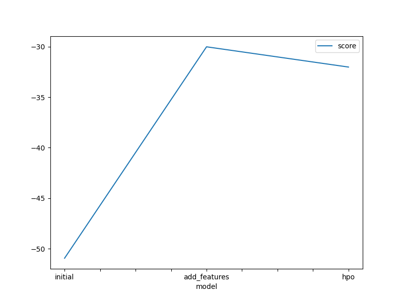
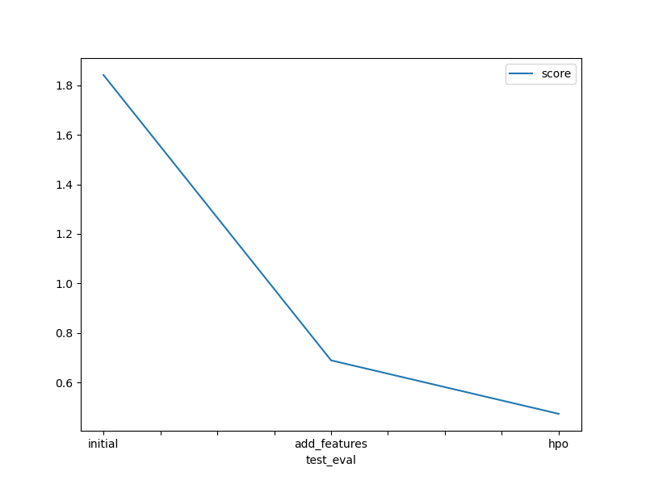

# Report: Predict Bike Sharing Demand with AutoGluon Solution
#### Soong Lee

## Initial Training
### What did you realize when you tried to submit your predictions? What changes were needed to the output of the predictor to submit your results?
As I followed the instruction given in the project-template notebook by replacing the negative predictions to zero, there was no problem in submitting my predictions to Kaggle.

### What was the top ranked model that performed?
WeightedEnsemble_L3 performed the best.

## Exploratory data analysis and feature creation
### What did the exploratory analysis find and how did you add additional features?
Month, day, and hour were extracted from the datetime feature, since they can affect the bike riding demands. Hour was added as an additional feature. 
Also season and weather features were converted to categorical, since their digit can give the modeling a wrong preference.

### How much better did your model preform after adding additional features and why do you think that is?
Adding hour and categorical season and weather improved the performance significantly in Kaggle score from 1.81 to 0.62. This is expected because hour of the day clearly affect the bike riding demands, and having season and weather as categories instead of digits must have helped the modeling to be unbiased.

## Hyper parameter tuning
### How much better did your model preform after trying different hyper parameters?
The performance with optimized hyperparameters did not improve as much as with the additional features according to Kaggle scores. 

### If you were given more time with this dataset, where do you think you would spend more time?
I would explore more hyperparameters of the LGBM and possibly longer training time.

### Create a table with the models you ran, the hyperparameters modified, and the kaggle score.
|model|hpo1|hpo2|hpo3|score|
|--|--|--|--|--|
|initial|"default"|"default"|"default"|1.84154|
|add_features|"default"|"default"|"default"|0.68948|
|hpo|"LGBM:num_leaves=37"|"LGBM:learning_rate=0.076"|"RF:max_depth=30"|0.47353|

### Create a line plot showing the top model score for the three (or more) training runs during the project.

### Create a line plot showing the top kaggle score for the three (or more) prediction submissions during the project.

## Summary
AutoGluon is a powerful tool to try out many algorithms with bagging and ensembles in such a short time, which enables us to select a few candidate algorithms to improve further. This is a much better way than to theoretically select algorithms. The additional features and hyperparameter tuning definitely improved the performance.